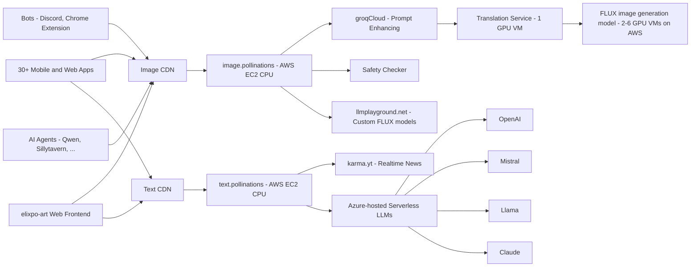

# [Elixpo-art](https://elixpoart.vercel.app)


*Your Engine for Personalized Synthetic Media*
## 🚀 Key Features

- 🔓 **100% Open Source**
- 🆓 **_Free to use_**
- 🔑 No signup or API keys
- 🖼️ **Embed like any normal image or text**
- 🤝 Used by various **open-source LLMs**, **bots**, and **communities**


## Hacktoberfest 2024

Hacktoberfest 2024 is an opportunity for developers and enthusiasts to contribute to open-source projects. We are excited to participate and encourage community involvement in our ElixpoAI Art Generator project. 

During this event, we welcome contributions in the form of bug fixes, feature enhancements, documentation improvements, and more. By collaborating with fellow developers, we aim to enhance our project and create a vibrant community around AI art generation.

Join us in making a positive impact in the open-source ecosystem this Hacktoberfest! Whether you're a seasoned contributor or new to open-source, your contributions are valuable and appreciated.


## Project Overview

This project is an AI-powered art generator that combines a robust backend with a user-friendly frontend. The generator utilizes various machine learning models and algorithms to create unique and captivating artwork based on user input.


<a href="https://star-history.com/#Circuit-Overtime/elixpo_ai_chapter&Date">
  <picture>
    <source media="(prefers-color-scheme: dark)" srcset="https://api.star-history.com/svg?repos=Circuit-Overtime/elixpo_ai_chapter&type=Date&theme=dark" width="600" />
    <source media="(prefers-color-scheme: light)" srcset="https://api.star-history.com/svg?repos=Circuit-Overtime/elixpo_ai_chapter&type=Date" width="600" />
    
  </picture>
</a>


## Features

* **AI Art Generation:**  Generates diverse art styles using advanced machine learning models.
* **Image Enhancement:**  Applies various visual effects to enhance existing images.
* **Prompt Enhancement:**  Provides tools for refining and optimizing prompts for optimal AI art generation.
* **User Interface:**  A web-based interface offers a seamless and interactive experience for generating and manipulating artwork.
* **Social Media Integration:**  Enables easy sharing of generated artwork across social media platforms.
* **Firebase Integration:**  Leverages Firebase services for authentication, storage, and database management.
* **Dataset Management:**  Includes tools for building and refining datasets used for training AI models.
* **Server Network:**  A network of servers facilitates efficient image processing and delivery.
* **ServerSide-Tracking:** All the requests are tracked by the server and has dependencies alongisde where a csv file is being made to process further LLM improvements

## Installation

1. **Setup virtual environment:**
   ```bash
   python -m venv .venv
   source .venv/bin/activate 
   ```
2. **Install dependencies:**
   ```bash
   pip install -r requirements.txt
   ```

## Usage

1. **Start the server:**
   ```bash
   ./server.sh 
   ```
2. **Access the web interface:**
   Open your web browser and navigate to `http://localhost:5000`.
3. **Generate artwork:**
   Follow the prompts and instructions on the website to create your AI art.


## Architecture



## Development Note

The website is being built in a private repository, but updates are being made in the open-source version to keep track of changes and ensure security. This project is part of Hacktoberfest, and we welcome contributions from open-source developers.

Additionally, Kaggle builds are being created for the dataset to be published, and a model is being developed under specific circumstances. A Discord bot is also in development for the same purpose, alongside a Minecraft mod utilizing the Fabric API of version 1.21 to process requests and generate images in-game.

Research papers will be published, and efforts to fine-tune stickers and improve code readability are underway to make the repository more user-friendly.

## Collaborators

We are excited to collaborate with various developers and artists in the open-source community. If you are interested in contributing, please reach out! Together, we aim to enhance the capabilities of this art generator.

## Funding

This project is currently funded through a combination of personal investments and community contributions. We are exploring sponsorship opportunities to further expand the project's development and outreach. If you would like to support us or discuss potential funding options, please contact us.


## Gallery

You can explore the generated artwork in our [Gallery](https://elixpoart.vercel.app/src/gallery). 

We can include a query parameter `id` to help share specific images by their image ID. For example, you can access an image directly using the following link:

[https://elixpoart.vercel.app/src/gallery?id=9pde71i621](https://elixpoart.vercel.app/src/gallery?id=9pde71i621)

### Kaggle and Data Science Builds

We are planning to enhance our presence on Kaggle by creating and sharing various data science writings and scripts. These builds will focus on optimizing the dataset for our AI models and providing insights into data processing techniques. Our goal is to foster a community around data science practices and encourage collaboration on Kaggle.

- [15/10/2024]
- Code from Kaggle!
```bash
https://www.kaggle.com/code/circuitovertime/elixpo-ai-platform-testing-beta/edit/run/199734513
```
- Code from Google Colab!
```bash
https://colab.research.google.com/drive/1jfJKeganPiY2i2T-vR_TlPQuMKEq8SC_?usp=sharing
```
- A custom made prompt_collection for further research work
```bash
https://www.kaggle.com/datasets/circuitovertime/prompt-and-gibberish-for-ai-art-gen/data?select=prompts_collection.csv
```
- A custom made prompt pimper using `Elixpo/promptPimp` model of hugging-face
```bash
https://www.kaggle.com/code/overtimecraftsclips/fine-tuning-of-elixpo-promptpimp
```

- Added the kaggle research begind the backend of a low level model for prompt classification
- Added files under the /kaggle_workflows mentioning the ipnyb files of Kaggle and Google Colab!
- Added a custom dataset made especially for the low level model

### Chrome Extension
- A Custom Built Chrome Extension in Javascript which is approved by Google!
```bash
https://chromewebstore.google.com/detail/elixpo-art-select-text-an/hcjdeknbbbllfllddkbacfgehddpnhdh
```

### Discord Bot 
- A custom made discord bot for generating images using `discord.js` and `Discord API` implementation.
```bash
https://discord.com/oauth2/authorize?client_id=1214916249222643752
```

### Blogs Release 
- Released a detailed analysis blog for Elixpo_Art Service
```bash
  https://elixpoart.vercel.app/src/blogs/elixpo_art
```
### Minecraft Bots

In the future, we aim to expand the functionality  to, our Minecraft mod will be enhanced to support more complex interactions, allowing players to generate and manipulate images directly within the game. We envision these tools becoming integral parts of our ecosystem, enhancing user engagement and creativity.


## 🏢 Supported By

- [LLMPlayground.net](https://llmplayground.net/): Hosting Custom Flux Models
- [Karma.YT](https://karma.yt): Social media integrations
- [AWS Activate](https://aws.amazon.com/): GPU Cloud Credits
- [Google Cloud for Startups](https://cloud.google.com/): GPU Cloud Credits
- [OVH Cloud](https://www.ovhcloud.com/): GPU Cloud credits
- [NVIDIA Inception](https://www.nvidia.com/en-us/deep-learning-ai/startups/): AI startup support
- [Azure (MS for Startups)](https://azure.microsoft.com/): OpenAI credits
- [Outlier Ventures](https://outlierventures.io/): Startup Accelerator


## 🌍 Our Vision

Elixpo-ai-chapter envisions a future where AI technology is:

- **Open & Accessible**: We believe AI should be available to everyone, not locked behind paywalls or restricted access

- **Transparent & Ethical**: Our open-source approach ensures transparency in how our models work and behave

- **Community-Driven**: We're building a platform where developers, creators, and AI enthusiasts can collaborate and innovate

- **Interconnected**: We're creating an ecosystem where AI services can seamlessly work together, fostering innovation through composability

- **Evolving**: We embrace the rapid evolution of AI technology while maintaining our commitment to openness and accessibility

We're committed to developing AI technology that serves humanity while respecting ethical boundaries and promoting responsible innovation. Join us in shaping the future of AI.

### Stargazers

<p align="left">
  <a href="https://reporoster.com/stars/dark/Circuit-Overtime/elixpo_ai_chapter">
    
  </a>
</p>


## License

This software is made available under the terms of *either* of the licenses
found in LICENSE.APACHE or LICENSE.BSD. Contributions to uritemplate are
made under the terms of *both* these licenses. 

---

Made with ❤️ by Ayushman Bhattacharya & Collabs!
